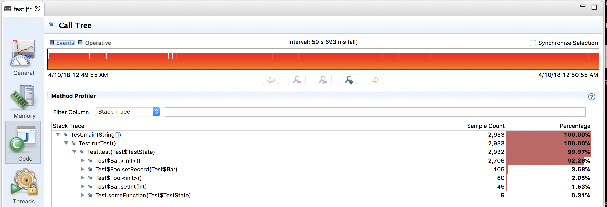
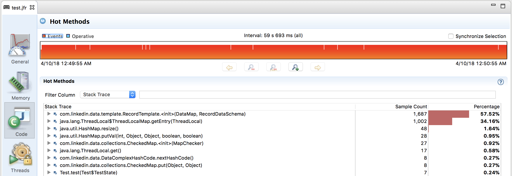

# DebugNonSafepoints problem

This project reproduces situation where `-XX:+DebugNonSafepoints` flag generates incorrect data. With `-XX:+DebugNonSafepoints` JVM produces additional debug information but mapping between JIT generated code and Java method names is incorrect. This issue is now being tracked as [JDK-8201516](https://bugs.openjdk.java.net/browse/JDK-8201516).

Program under test is very simple:

```
  @State(Scope.Benchmark)
  public static class TestState {
    byte[] source = new byte[32*1024];
    byte[] target = new byte[32*1024];
  }

  @Benchmark
  @BenchmarkMode(Mode.AverageTime)
  @OutputTimeUnit(TimeUnit.NANOSECONDS)
  public Foo test(TestState state) {

    someFunction(state);

    Foo foo = new Foo();
    Bar bar = new Bar();
    foo.setRecord(bar);
    bar.setInt(54);
    return foo;
  }

  public static void main(String[] args) throws Exception {
    new Test().runTest();
  }

  public void runTest() throws InterruptedException
  {
    TestState state = new TestState();
    for (int i= 0; i < Integer.MAX_VALUE; ++i)
    {
      test(state);
    }
  }

  void someFunction(TestState state) {
    arraycopy(state.source, 0, state.target, 0, state.source.length);
  }

  public void arraycopy(byte[] source, int srcPos, byte[] target, int destPos, int length) {
    for (int i = 0; i < length; i++) {
      target[destPos + i] = source[srcPos + i];
    }
  }
```

In short: we run `test` method in a very long `for` loop. The `test` method consists of `someFunction` and few small operations after that. It is not relevant what those operations are. The key is that the main cost of the `test` function is in `someFunction` which copies 32K of memory. If you are not convinced where the main cost is you can run jmh benchmark: `java -jar target/jmh-benchmark.jar -f 2`, then modify program a bit e.g. instead of copying entire bytes array copy just one byte and re-run benchmark.

Build: `mvn package`

Run the test: `java -XX:+UnlockCommercialFeatures -XX:+FlightRecorder -XX:+UnlockDiagnosticVMOptions -XX:+DebugNonSafepoints -XX:StartFlightRecording=duration=1m,delay=30s,filename=test.jfr -jar target/debugnonsafepoint-problem-0.0.1-SNAPSHOT-jar-with-dependencies.jar`

This will start flight recorder after 30s and let it run for 1m. After recording is done open `test.jfr` file. If you don't care to run test yourself you can find the recording under `results/test.jft` You will notice that, according to JFR, most of the time is not spent in `someFunction`:



This would not be surprising if we used profiler which is prone to safepoint bias or we forgot to add `-XX:+DebugNonSafepoints` flag. The problem is that we used `-XX:+DebugNonSafepoints` flag so we should expect result to be more accurate. After spending some time debugging this issue I believe this is a JVM bug which causes debug information to be inacurate. AFAIK this bug affects all profilers that depend on `-XX:+DebugNonSafepoints` e.g. perf, async-profiler, jmh perfasm, honest-profiler etc. 

Below are few experimenmts I did to further understand this problem.

# -XX:+PrintAssembly and perf

Let's run the program with more dubugging flags, including `-XX:+PrintAssembly`: `java -XX:+UnlockDiagnosticVMOptions -XX:+DebugNonSafepoints -XX:+LogCompilation -XX:LogFile=test.log -XX:+PrintAssembly -XX:+PrintInterpreter -XX:+PrintNMethodsXX:+PrintNativeNMethods -XX:+PrintSignatureHandlers -XX:+PrintAdapterHandlers -XX:+PrintStubCode -XX:+PrintCompilation -XX:+PrintInlining -XX:+TraceClassLoading -XX:+UnlockCommercialFeatures -XX:+FlightRecorder -XX:StartFlightRecording=duration=1m,delay=30s,filename=test.jfr -jar target/debugnonsafepoint-problem-0.0.1-SNAPSHOT-jar-with-dependencies.jar  > test.out`

After ~20s, when program is in steady state, let's run perf top: `sudo perf top -p <PID>`

```
  20.36%  perf-39569.map      [.] 0x00007fd374312140
  19.25%  perf-39569.map      [.] 0x00007fd37431214a
  19.23%  perf-39569.map      [.] 0x00007fd374312143
  17.49%  perf-39569.map      [.] 0x00007fd374312157
  13.82%  perf-39569.map      [.] 0x00007fd374312151
   0.17%  libjvm.so           [.] SpinPause
   0.14%  perf-39569.map      [.] 0x00007fd374312304
(...)
```

Now we can take a look at `-XX:+PrintAssembly` output. You can find the output at `results/test.out`. Searching for `0x00007fd374312140` that perf identified as one of the hottest places gives us the following:

```
(...)
  0x00007fd37431213e: nop                       ;*putfield _schema
                                                ; - com.linkedin.data.template.RecordTemplate::<init>@11 (line 50)
                                                ; - Test$Bar::<init>@11 (line 95)
                                                ; - Test::test@17 (line 32)

  0x00007fd374312140: movsxd  %edi,%r10         ;*putfield _map
                                                ; - com.linkedin.data.template.RecordTemplate::<init>@6 (line 49)
                                                ; - Test$Bar::<init>@11 (line 95)
                                                ; - Test::test@17 (line 32)

  0x00007fd374312143: vmovq   0x10(%rdx,%r10),%xmm0
  0x00007fd37431214a: vmovq   %xmm0,0x10(%rbx,%r10)  ;*invokespecial <init>
                                                ; - com.linkedin.data.template.RecordTemplate::<init>@1 (line 48)
                                                ; - Test$Bar::<init>@11 (line 95)
                                                ; - Test::test@17 (line 32)

  0x00007fd374312151: add     $0x8,%edi
  0x00007fd374312154: cmp     %r8d,%edi
  0x00007fd374312157: jl      0x7fd374312140    ;*arraylength
                                                ; - java.lang.ThreadLocal$ThreadLocalMap::getEntry@8 (line 414)
                                                ; - java.lang.ThreadLocal$ThreadLocalMap::access$000@2 (line 298)
                                                ; - java.lang.ThreadLocal::get@16 (line 163)
                                                ; - com.linkedin.data.DataComplexHashCode::nextHashCode@3 (line 48)
                                                ; - com.linkedin.data.DataMap::<init>@18 (line 434)
                                                ; - Test$Bar::<init>@5 (line 95)
                                                ; - Test::test@17 (line 32)

  0x00007fd374312159: cmp     %ecx,%edi
  0x00007fd37431215b: jnl     0x7fd374312174    ;*aaload
                                                ; - java.lang.ThreadLocal$ThreadLocalMap::getEntry@18 (line 415)
                                                ; - java.lang.ThreadLocal$ThreadLocalMap::access$000@2 (line 298)
                                                ; - java.lang.ThreadLocal::get@16 (line 163)
                                                ; - com.linkedin.data.DataComplexHashCode::nextHashCode@3 (line 48)
                                                ; - com.linkedin.data.DataMap::<init>@18 (line 434)
                                                ; - Test$Bar::<init>@5 (line 95)
                                                ; - Test::test@17 (line 32)

  0x00007fd37431215d: nop
(...)
```
It has been a while since I looked at assembly but hot code between `0x00007fd374312140` and `0x00007fd374312157` looks a lot like a main loop of an array copy. Comments however don't match the code.

Looking only at the comments one would conclude that majority of time is spent in `com.linkedin.data.template.RecordTemplate::<init>` and `java.lang.ThreadLocal$ThreadLocalMap::getEntry`. Let's see what JFR reported as hot methods:



Perfect match.

I tested this program with couple of other tools that depend on data generated by `-XX:+DebugNonSafepoints`: perf + perf-map-agent + flamegraphs and jmh perfasm - both report the wrong thing. Here is part of output after running `java -jar target/jmh-benchmark.jar -prof perfasm -f 2`:

```
  0.01%   ?   0x00007fb004717ceb: nopl    0x0(%rax,%rax)    ;*putfield _dataObject
          ?                                                 ; - com.linkedin.data.template.DataObjectToObjectCache$DataObjectKey::&lt;init&gt;@42 (line 85)
          ?                                                 ; - com.linkedin.data.template.DataObjectToObjectCache::put@10 (line 61)
          ?                                                 ; - com.linkedin.data.template.RecordTemplate::putWrapped@48 (line 272)
          ?                                                 ; - com.linkedin.data.template.RecordTemplate::putWrapped@7 (line 298)
          ?                                                 ; - org.tests.Test$Foo::setRecord@7 (line 82)
          ?                                                 ; - org.tests.Test::test@23 (line 34)
          ?                                                 ; - org.tests.generated.Test_test_jmhTest::test_avgt_jmhStub@19 (line 195)
 13.66%   ??  0x00007fb004717cf0: movsxd  %ebx,%r11         ;*putfield _hashCode
          ??                                                ; - com.linkedin.data.template.DataObjectToObjectCache$DataObjectKey::&lt;init&gt;@26 (line 78)
          ??                                                ; - com.linkedin.data.template.DataObjectToObjectCache::put@10 (line 61)
          ??                                                ; - com.linkedin.data.template.RecordTemplate::putWrapped@48 (line 272)
          ??                                                ; - com.linkedin.data.template.RecordTemplate::putWrapped@7 (line 298)
          ??                                                ; - org.tests.Test$Foo::setRecord@7 (line 82)
          ??                                                ; - org.tests.Test::test@23 (line 34)
          ??                                                ; - org.tests.generated.Test_test_jmhTest::test_avgt_jmhStub@19 (line 195)
 14.90%   ??  0x00007fb004717cf3: vmovq   0x10(%rdx,%r11),%xmm0
 23.59%   ??  0x00007fb004717cfa: vmovq   %xmm0,0x10(%r8,%r11)  ;*ifeq
          ??                                                ; - com.linkedin.data.template.DataObjectToObjectCache$DataObjectKey::&lt;init&gt;@13 (line 76)
          ??                                                ; - com.linkedin.data.template.DataObjectToObjectCache::put@10 (line 61)
          ??                                                ; - com.linkedin.data.template.RecordTemplate::putWrapped@48 (line 272)
          ??                                                ; - com.linkedin.data.template.RecordTemplate::putWrapped@7 (line 298)
          ??                                                ; - org.tests.Test$Foo::setRecord@7 (line 82)
          ??                                                ; - org.tests.Test::test@23 (line 34)
          ??                                                ; - org.tests.generated.Test_test_jmhTest::test_avgt_jmhStub@19 (line 195)
 19.76%   ??  0x00007fb004717d01: add     $0x8,%ebx         ;*putfield _checker
          ??                                                ; - com.linkedin.data.collections.CheckedMap::&lt;init&gt;@11 (line 105)
          ??                                                ; - com.linkedin.data.DataMap::&lt;init&gt;@4 (line 74)
          ??                                                ; - org.tests.Test$Bar::&lt;init&gt;@5 (line 96)
          ??                                                ; - org.tests.Test::test@17 (line 33)
          ??                                                ; - org.tests.generated.Test_test_jmhTest::test_avgt_jmhStub@19 (line 195)
 12.67%   ??  0x00007fb004717d04: cmp     %r10d,%ebx
  0.01%   ??  0x00007fb004717d07: jl      0x7fb004717cf0    ;*new  ; - com.linkedin.data.template.DataObjectToObjectCache::&lt;init&gt;@5 (line 43)
          ?                                                 ; - com.linkedin.data.template.RecordTemplate::getCache@12 (line 492)
          ?                                                 ; - com.linkedin.data.template.RecordTemplate::putWrapped@38 (line 272)
          ?                                                 ; - com.linkedin.data.template.RecordTemplate::putWrapped@7 (line 298)
          ?                                                 ; - org.tests.Test$Foo::setRecord@7 (line 82)
          ?                                                 ; - org.tests.Test::test@23 (line 34)
          ?                                                 ; - org.tests.generated.Test_test_jmhTest::test_avgt_jmhStub@19 (line 195)
  0.01%   ?   0x00007fb004717d09: cmp     %r9d,%ebx
              0x00007fb004717d0c: jl      0x7fb0047174fc    ;*return
                                                            ; - java.lang.Object::&lt;init&gt;@0 (line 37)
                                                            ; - com.linkedin.data.template.DataObjectToObjectCache::&lt;init&gt;@1 (line 42)
                                                            ; - com.linkedin.data.template.RecordTemplate::getCache@12 (line 492)
```

Jmh identified hot code but comments are wrong.

I run those tests many times and source code to which the hot code is attributed to varies between the runs.

# Problem "goes away"

I observed that problem "goes away" in two situations:

* After connecting with JVisualVM
* After Flight Recorder finished recording

I am not sure if it is recompilaton that fixes `-XX:+DebugNonSafepoints` data or some other JVM internal mechanism (moving code around?) but address at which the hot loop is located gets changed and debug information is fixed.

Here is how it works.

I started program with JFR recording e.g. `java -XX:+UnlockCommercialFeatures -XX:+FlightRecorder -XX:+UnlockDiagnosticVMOptions -XX:+DebugNonSafepoints -XX:StartFlightRecording=duration=1m,delay=30s,filename=test.jfr -jar target/debugnonsafepoint-problem-0.0.1-SNAPSHOT-jar-with-dependencies.jar`

After ~15s, when app reaches steady state the perf shows the following:

```
  20.36%  perf-39569.map      [.] 0x00007fd374312140
  19.25%  perf-39569.map      [.] 0x00007fd37431214a
  19.23%  perf-39569.map      [.] 0x00007fd374312143
  17.49%  perf-39569.map      [.] 0x00007fd374312157
  13.82%  perf-39569.map      [.] 0x00007fd374312151
   0.17%  libjvm.so           [.] SpinPause
   0.14%  perf-39569.map      [.] 0x00007fd374312304
(...)
```

Assembly comments for hot code are incorrect:

```
(...)
  0x00007fd374312140: movsxd  %edi,%r10         ;*putfield _map
                                                ; - com.linkedin.data.template.RecordTemplate::<init>@6 (line 49)
                                                ; - Test$Bar::<init>@11 (line 95)
                                                ; - Test::test@17 (line 32)

  0x00007fd374312143: vmovq   0x10(%rdx,%r10),%xmm0
  0x00007fd37431214a: vmovq   %xmm0,0x10(%rbx,%r10)  ;*invokespecial <init>
                                                ; - com.linkedin.data.template.RecordTemplate::<init>@1 (line 48)
                                                ; - Test$Bar::<init>@11 (line 95)
                                                ; - Test::test@17 (line 32)

  0x00007fd374312151: add     $0x8,%edi
  0x00007fd374312154: cmp     %r8d,%edi
  0x00007fd374312157: jl      0x7fd374312140    ;*arraylength
                                                ; - java.lang.ThreadLocal$ThreadLocalMap::getEntry@8 (line 414)
                                                ; - java.lang.ThreadLocal$ThreadLocalMap::access$000@2 (line 298)
                                                ; - java.lang.ThreadLocal::get@16 (line 163)
                                                ; - com.linkedin.data.DataComplexHashCode::nextHashCode@3 (line 48)
                                                ; - com.linkedin.data.DataMap::<init>@18 (line 434)
                                                ; - Test$Bar::<init>@5 (line 95)
                                                ; - Test::test@17 (line 32)
(...)
```

Just after JFR fished recording perf shows some "new code" is getting hot. In snapshot below we can see mix of what previously was hot and some new code:

```
   9.76%  perf-39569.map      [.] 0x00007fd374312140
   9.57%  perf-39569.map      [.] 0x00007fd37431214a
   9.38%  perf-39569.map      [.] 0x00007fd3743393a0
   9.33%  perf-39569.map      [.] 0x00007fd374312143
   9.09%  perf-39569.map      [.] 0x00007fd3743393a3
   9.05%  perf-39569.map      [.] 0x00007fd3743393aa
   8.67%  perf-39569.map      [.] 0x00007fd374312157
   8.37%  perf-39569.map      [.] 0x00007fd3743393b8
   6.57%  perf-39569.map      [.] 0x00007fd374312151
   6.30%  perf-39569.map      [.] 0x00007fd3743393b1
   0.34%  libc-2.17.so        [.] _int_malloc
(...)
```

After some time the "new code" becomes the hot code. I believe `perf top` uses some kind of time based weighted averaging to bring up most recent code to the top. According to perf the hot code becomes:

```
  19.94%  perf-39569.map      [.] 0x00007fd3743393a0
  19.41%  perf-39569.map      [.] 0x00007fd3743393aa
  19.36%  perf-39569.map      [.] 0x00007fd3743393a3
  17.88%  perf-39569.map      [.] 0x00007fd3743393b8
  13.58%  perf-39569.map      [.] 0x00007fd3743393b1
   0.36%  libjvm.so           [.] SpinPause
(...)
```

The new hot code can be found in `-XX:+PrintAssembly` output by searching for `0x00007fd3743393a0`:

```
(...)
0x00007fd374339395: nopw    0x0(%rax,%rax)    ;*aload_3
                                                ; - Test::arraycopy@6 (line 57)
                                                ; - Test::someFunction@16 (line 52)
                                                ; - Test::test@2 (line 29)

  0x00007fd3743393a0: movsxd  %r11d,%r8
  0x00007fd3743393a3: vmovq   0x10(%r9,%r8),%xmm0
  0x00007fd3743393aa: vmovq   %xmm0,0x10(%rdx,%r8)  ;*bastore
                                                ; - Test::arraycopy@18 (line 57)
                                                ; - Test::someFunction@16 (line 52)
                                                ; - Test::test@2 (line 29)

  0x00007fd3743393b1: add     $0x8,%r11d        ;*iinc
                                                ; - Test::arraycopy@19 (line 56)
                                                ; - Test::someFunction@16 (line 52)
                                                ; - Test::test@2 (line 29)

  0x00007fd3743393b5: cmp     %r10d,%r11d
  0x00007fd3743393b8: jl      0x7fd3743393a0    ;*if_icmplt
                                                ; - Test::arraycopy@26 (line 56)
                                                ; - Test::someFunction@16 (line 52)
                                                ; - Test::test@2 (line 29)

  0x00007fd3743393ba: cmp     %ebx,%r11d
  0x00007fd3743393bd: jnl     0x7fd3743393d6
  0x00007fd3743393bf: nop                       ;*aload_3
                                                ; - Test::arraycopy@6 (line 57)
                                                ; - Test::someFunction@16 (line 52)
                                                ; - Test::test@2 (line 29)
(...)
```

Here we can see our hot loop and this time comments are correct. I tested with some profilers that depend on `-XX:+DebugNonSafepoints` that at this point the blamed code is correct.

# Final notes

I reproduced this problem on both Linux and MacOS with various versions of java 8. AFAICT this is a JVM bug. Hopefully this writeup will help fixing it.

